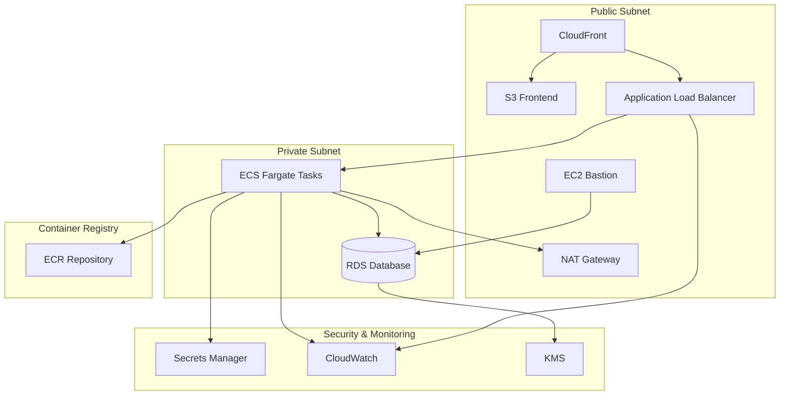

# ECS Architecture Template

## Overview
This steering document provides comprehensive guidance for generating Terraform code for an ECS (Elastic Container Service) based containerized architecture on AWS. The architecture includes frontend hosting, ECS services with containers, ECR registry, RDS database, and all necessary networking and security components.

## Architecture Components

### Frontend Layer
- **CloudFront**: CDN distribution for global content delivery
- **S3 Bucket**: Static website hosting for frontend assets
- **Certificate Manager**: SSL/TLS certificates for HTTPS

### Container Layer
- **ECS Cluster**: Container orchestration cluster
- **ECS Service**: Service definition with desired count and deployment configuration
- **ECS Task Definition**: Container specifications (image, CPU, memory, environment)
- **ECR Repository**: Private Docker image registry
- **Application Load Balancer**: Traffic distribution to ECS tasks
- **Target Group**: Health checks and routing for containers
- **ECS Execution Role**: IAM role for pulling images and logging
- **ECS Task Role**: IAM role for application permissions

### Data Layer
- **RDS Instance**: PostgreSQL/MySQL in private subnet
- **RDS Subnet Group**: Multi-AZ subnet configuration
- **Secrets Manager**: Database credentials and application secrets
- **RDS Security Group**: Database access control

### Network Layer
- **VPC**: Isolated network environment
- **Public Subnets**: For ALB, NAT Gateway, Bastion (minimum 2 AZs)
- **Private Subnets**: For ECS tasks, RDS (minimum 2 AZs)
- **Internet Gateway**: Public internet access
- **NAT Gateway**: Outbound internet for private subnets (one per AZ for HA)
- **Route Tables**: Public and private routing

### Management & Monitoring
- **EC2 Bastion Host**: Secure access to private resources
- **CloudWatch Log Groups**: ECS task logs and ALB logs
- **CloudWatch Alarms**: Monitoring and alerting
- **S3 Backend Bucket**: Terraform state storage with versioning

### Security
- **Security Groups**: Granular network access control (ALB, ECS, RDS, Bastion)
- **KMS Keys**: Encryption for RDS, S3, Secrets Manager, ECR
- **IAM Roles & Policies**: Least privilege access


## Project Structure

```
terraform/
├── environments/
│   ├── dev/
│   │   ├── main.tf
│   │   ├── variables.tf
│   │   ├── outputs.tf
│   │   ├── backend.tf
│   │   └── terraform.tfvars
│   ├── staging/
│   └── prod/
├── modules/
│   ├── networking/
│   │   ├── main.tf
│   │   ├── variables.tf
│   │   ├── outputs.tf
│   │   └── README.md
│   ├── frontend/
│   │   ├── main.tf (CloudFront, S3)
│   │   ├── variables.tf
│   │   ├── outputs.tf
│   │   └── README.md
│   ├── ecr/
│   │   ├── main.tf
│   │   ├── variables.tf
│   │   ├── outputs.tf
│   │   └── README.md
│   ├── alb/
│   │   ├── main.tf
│   │   ├── variables.tf
│   │   ├── outputs.tf
│   │   └── README.md
│   ├── ecs/
│   │   ├── main.tf
│   │   ├── variables.tf
│   │   ├── outputs.tf
│   │   └── README.md
│   ├── database/
│   │   ├── main.tf (RDS, Secrets Manager)
│   │   ├── variables.tf
│   │   ├── outputs.tf
│   │   └── README.md
│   ├── key-management/
│   │   ├── main.tf (TLS key, S3 bucket, KMS encryption)
│   │   ├── variables.tf
│   │   ├── outputs.tf
│   │   └── README.md
│   ├── bastion/
│   │   ├── main.tf
│   │   ├── variables.tf
│   │   ├── outputs.tf
│   │   └── README.md
│   └── monitoring/
│       ├── main.tf (CloudWatch)
│       ├── variables.tf
│       ├── outputs.tf
│       └── README.md
└── global/
    └── backend/
        ├── main.tf (S3 for state, use_lockfile for locking)
        └── outputs.tf
```


## Module Implementation Guidelines

### 1. Networking Module

**Purpose**: Create VPC with public/private subnets, IGW, NAT Gateway, and route tables

**Key Resources**:
- `aws_vpc` - Enable DNS hostnames and support
- `aws_subnet` - Public subnets (2+ AZs) with map_public_ip_on_launch
- `aws_subnet` - Private subnets (2+ AZs) for ECS tasks and RDS
- `aws_internet_gateway` - Attached to VPC
- `aws_eip` - For NAT Gateway (one per AZ)
- `aws_nat_gateway` - In each public subnet for HA
- `aws_route_table` - Public route table (0.0.0.0/0 → IGW)
- `aws_route_table` - Private route tables (0.0.0.0/0 → NAT Gateway)
- `aws_route_table_association` - Associate subnets

**Variables**:
```hcl
variable "vpc_cidr" {
  type        = string
  description = "CIDR block for VPC"
  default     = "10.0.0.0/16"
}

variable "availability_zones" {
  type        = list(string)
  description = "List of availability zones"
}

variable "public_subnet_cidrs" {
  type        = list(string)
  description = "CIDR blocks for public subnets"
}

variable "private_subnet_cidrs" {
  type        = list(string)
  description = "CIDR blocks for private subnets"
}

variable "enable_nat_gateway" {
  type        = bool
  description = "Enable NAT Gateway for private subnets"
  default     = true
}

variable "single_nat_gateway" {
  type        = bool
  description = "Use single NAT Gateway (not recommended for prod)"
  default     = false
}
```

**Outputs**:
- vpc_id, vpc_cidr_block
- public_subnet_ids, private_subnet_ids
- nat_gateway_ids
- internet_gateway_id

**Security Considerations**:
- Enable VPC Flow Logs to CloudWatch
- Use separate subnets for different tiers
- Implement NACLs for additional security layer


### 2. Frontend Module (CloudFront + S3)

**Purpose**: Host static frontend with CloudFront CDN

**Key Resources**:
- `aws_s3_bucket` - Frontend assets storage
- `aws_s3_bucket_public_access_block` - Block public access
- `aws_s3_bucket_versioning` - Enable versioning
- `aws_s3_bucket_server_side_encryption_configuration` - Enable encryption
- `aws_cloudfront_origin_access_identity` - OAI for S3 access
- `aws_cloudfront_distribution` - CDN configuration
- `aws_s3_bucket_policy` - Allow CloudFront OAI access
- `aws_acm_certificate` - SSL certificate (us-east-1 region)

**Variables**:
```hcl
variable "domain_name" {
  type        = string
  description = "Domain name for CloudFront distribution"
}

variable "acm_certificate_arn" {
  type        = string
  description = "ACM certificate ARN (must be in us-east-1)"
}

variable "price_class" {
  type        = string
  description = "CloudFront price class"
  default     = "PriceClass_100"
}
```

**Security**:
- Enable CloudFront logging to S3
- Use HTTPS only (redirect HTTP to HTTPS)
- Enable WAF for CloudFront (optional)
- Set appropriate cache behaviors


### 3. ECR Module

**Purpose**: Private Docker image registry for container images

**Key Resources**:
- `aws_ecr_repository` - Container image repository
- `aws_ecr_lifecycle_policy` - Image retention policy
- `aws_ecr_repository_policy` - Access control policy
- `aws_kms_key` - Encryption key for images
- `aws_kms_alias` - Key alias

**Variables**:
```hcl
variable "repository_name" {
  type        = string
  description = "ECR repository name"
}

variable "image_tag_mutability" {
  type        = string
  description = "Image tag mutability (MUTABLE or IMMUTABLE)"
  default     = "MUTABLE"
}

variable "scan_on_push" {
  type        = bool
  description = "Enable image scanning on push"
  default     = true
}

variable "lifecycle_policy" {
  type        = string
  description = "Lifecycle policy for image retention"
  default     = <<EOF
{
  "rules": [
    {
      "rulePriority": 1,
      "description": "Keep last 10 images",
      "selection": {
        "tagStatus": "any",
        "countType": "imageCountMoreThan",
        "countNumber": 10
      },
      "action": {
        "type": "expire"
      }
    }
  ]
}
EOF
}
```

**Security**:
- Enable encryption at rest using KMS
- Enable image scanning for vulnerabilities
- Implement lifecycle policies to manage costs
- Use IAM policies for access control
- Enable immutable tags for production images

**Outputs**:
- repository_url
- repository_arn
- registry_id


### 4. Application Load Balancer Module

**Purpose**: Distribute traffic to ECS tasks with health checks

**Key Resources**:
- `aws_lb` - Application Load Balancer
- `aws_lb_target_group` - Target group for ECS tasks
- `aws_lb_listener` - HTTPS listener (port 443)
- `aws_lb_listener` - HTTP listener (port 80, redirect to HTTPS)
- `aws_lb_listener_rule` - Routing rules
- `aws_security_group` - ALB security group
- `aws_acm_certificate` - SSL certificate

**Variables**:
```hcl
variable "alb_name" {
  type        = string
  description = "Application Load Balancer name"
}

variable "internal" {
  type        = bool
  description = "Whether ALB is internal"
  default     = false
}

variable "health_check" {
  type = object({
    enabled             = bool
    healthy_threshold   = number
    interval            = number
    matcher             = string
    path                = string
    port                = string
    protocol            = string
    timeout             = number
    unhealthy_threshold = number
  })
  description = "Health check configuration"
  default = {
    enabled             = true
    healthy_threshold   = 2
    interval            = 30
    matcher             = "200"
    path                = "/health"
    port                = "traffic-port"
    protocol            = "HTTP"
    timeout             = 5
    unhealthy_threshold = 2
  }
}

variable "deregistration_delay" {
  type        = number
  description = "Time to wait before deregistering target"
  default     = 30
}
```

**Security**:
- Use HTTPS only (redirect HTTP to HTTPS)
- Enable access logs to S3
- Enable deletion protection for production
- Use security groups to restrict access
- Enable WAF for additional protection (optional)

**Outputs**:
- alb_arn
- alb_dns_name
- alb_zone_id
- target_group_arn
- security_group_id


### 5. ECS Module

**Purpose**: Container orchestration with ECS Fargate or EC2

**Key Resources**:
- `aws_ecs_cluster` - ECS cluster
- `aws_ecs_cluster_capacity_providers` - Fargate or EC2 capacity
- `aws_ecs_task_definition` - Container specifications
- `aws_ecs_service` - Service with desired count and deployment config
- `aws_iam_role` - ECS execution role (pull images, logs)
- `aws_iam_role` - ECS task role (application permissions)
- `aws_iam_role_policy_attachment` - Managed policies
- `aws_iam_policy` - Custom policies
- `aws_security_group` - ECS tasks security group
- `aws_cloudwatch_log_group` - Container logs

**Variables**:
```hcl
variable "cluster_name" {
  type        = string
  description = "ECS cluster name"
}

variable "service_name" {
  type        = string
  description = "ECS service name"
}

variable "task_cpu" {
  type        = number
  description = "Task CPU units (256, 512, 1024, 2048, 4096)"
  default     = 256
}

variable "task_memory" {
  type        = number
  description = "Task memory in MB (512, 1024, 2048, etc.)"
  default     = 512
}

variable "container_definitions" {
  type        = string
  description = "Container definitions JSON"
}

variable "desired_count" {
  type        = number
  description = "Desired number of tasks"
  default     = 2
}

variable "launch_type" {
  type        = string
  description = "Launch type: FARGATE or EC2"
  default     = "FARGATE"
  validation {
    condition     = contains(["FARGATE", "EC2"], var.launch_type)
    error_message = "Launch type must be FARGATE or EC2"
  }
}

variable "deployment_configuration" {
  type = object({
    maximum_percent         = number
    minimum_healthy_percent = number
  })
  description = "Deployment configuration"
  default = {
    maximum_percent         = 200
    minimum_healthy_percent = 100
  }
}

variable "enable_execute_command" {
  type        = bool
  description = "Enable ECS Exec for debugging"
  default     = false
}
```

**Container Definition Example**:
```json
[
  {
    "name": "app",
    "image": "${ecr_repository_url}:latest",
    "cpu": 256,
    "memory": 512,
    "essential": true,
    "portMappings": [
      {
        "containerPort": 8080,
        "protocol": "tcp"
      }
    ],
    "environment": [
      {
        "name": "ENVIRONMENT",
        "value": "production"
      }
    ],
    "secrets": [
      {
        "name": "DB_PASSWORD",
        "valueFrom": "${secret_arn}:password::"
      }
    ],
    "logConfiguration": {
      "logDriver": "awslogs",
      "options": {
        "awslogs-group": "/ecs/app",
        "awslogs-region": "us-east-1",
        "awslogs-stream-prefix": "ecs"
      }
    }
  }
]
```

**IAM Permissions**:

**Execution Role** (for ECS agent):
- AmazonECSTaskExecutionRolePolicy (managed)
- ECR pull permissions
- Secrets Manager read permissions
- CloudWatch Logs write permissions

**Task Role** (for application):
- S3 access (if needed)
- DynamoDB access (if needed)
- SQS/SNS access (if needed)
- Custom application permissions

**Security**:
- Deploy tasks in private subnets only
- Use Fargate for serverless (no EC2 management)
- Enable ECS Exec only for debugging (disable in prod)
- Use Secrets Manager for sensitive data
- Enable container insights for monitoring
- Implement least privilege IAM policies

**Outputs**:
- cluster_id
- cluster_arn
- service_id
- service_name
- task_definition_arn
- security_group_id


### 6. Database Module (RDS)

**Purpose**: Managed relational database in private subnet

**Key Resources**:
- `aws_db_subnet_group` - Multi-AZ subnet group
- `aws_db_instance` - RDS instance
- `aws_security_group` - Database security group
- `aws_secretsmanager_secret` - Database credentials
- `aws_secretsmanager_secret_version` - Secret value
- `aws_kms_key` - Encryption key for RDS
- `aws_kms_alias` - Key alias
- `random_password` - Generate secure password

**Variables**:
```hcl
variable "engine" {
  type        = string
  description = "Database engine"
  default     = "postgres"
}

variable "engine_version" {
  type        = string
  description = "Database engine version"
  default     = "15.4"
}

variable "instance_class" {
  type        = string
  description = "RDS instance class"
  default     = "db.t3.micro"
}

variable "allocated_storage" {
  type        = number
  description = "Allocated storage in GB"
  default     = 20
}

variable "max_allocated_storage" {
  type        = number
  description = "Maximum storage for autoscaling"
  default     = 100
}

variable "database_name" {
  type        = string
  description = "Initial database name"
}

variable "master_username" {
  type        = string
  description = "Master username for RDS (must not be a reserved word)"
  default     = "dbadmin"
  validation {
    condition     = !contains(["admin", "user", "root", "postgres", "mysql", "rdsadmin", "master", "public"], lower(var.master_username))
    error_message = "master_username must not be a reserved word (admin, user, root, postgres, mysql, rdsadmin, master, public)."
  }
}

variable "multi_az" {
  type        = bool
  description = "Enable Multi-AZ deployment"
  default     = false
}

variable "backup_retention_period" {
  type        = number
  description = "Backup retention in days"
  default     = 7
}

variable "backup_window" {
  type        = string
  description = "Backup window"
  default     = "03:00-04:00"
}

variable "maintenance_window" {
  type        = string
  description = "Maintenance window"
  default     = "sun:04:00-sun:05:00"
}
```

**Security**:
- Deploy in private subnets only
- Enable encryption at rest using KMS
- Enable encryption in transit (SSL/TLS)
- Store credentials in Secrets Manager
- Enable automated backups
- Enable deletion protection for production
- Restrict security group to ECS tasks and Bastion only
- Enable Performance Insights
- Enable Enhanced Monitoring

**Outputs**:
- instance_id
- instance_endpoint
- instance_arn
- secret_arn
- security_group_id


### 7. Bastion Module

**Purpose**: Secure access to private resources

**Key Resources**:
- `aws_instance` - Bastion EC2 instance
- `aws_security_group` - Bastion security group
- `aws_eip` - Elastic IP for bastion
- `aws_key_pair` - SSH key pair
- `aws_iam_role` - Instance role for Systems Manager
- `aws_iam_instance_profile` - Instance profile

**Variables**:
```hcl
variable "instance_type" {
  type        = string
  description = "Bastion instance type"
  default     = "t3.micro"
}

variable "allowed_cidr_blocks" {
  type        = list(string)
  description = "CIDR blocks allowed to SSH"
}

variable "enable_session_manager" {
  type        = bool
  description = "Enable AWS Systems Manager Session Manager"
  default     = true
}
```

**Security**:
- Deploy in public subnet with EIP
- Restrict SSH access to specific IPs only
- Use Systems Manager Session Manager instead of SSH (recommended)
- Enable CloudWatch logging
- Disable password authentication
- Keep instance patched and updated

### 8. Monitoring Module (CloudWatch)

**Purpose**: Centralized logging and monitoring

**Key Resources**:
- `aws_cloudwatch_log_group` - Log groups for each service
- `aws_cloudwatch_metric_alarm` - Alarms for critical metrics
- `aws_sns_topic` - Notification topic
- `aws_sns_topic_subscription` - Email/SMS subscriptions
- `aws_cloudwatch_dashboard` - Monitoring dashboard

**Key Metrics to Monitor**:
- ECS: CPUUtilization, MemoryUtilization, RunningTaskCount, DesiredTaskCount
- ALB: RequestCount, TargetResponseTime, HTTPCode_Target_5XX_Count, HealthyHostCount, UnHealthyHostCount
- RDS: CPUUtilization, DatabaseConnections, FreeStorageSpace, ReadLatency, WriteLatency
- NAT Gateway: BytesOutToDestination, PacketsDropCount

**ECS-Specific Alarms**:
```hcl
# ECS CPU utilization alarm
resource "aws_cloudwatch_metric_alarm" "ecs_cpu_high" {
  alarm_name          = "${var.service_name}-cpu-high"
  comparison_operator = "GreaterThanThreshold"
  evaluation_periods  = 2
  metric_name         = "CPUUtilization"
  namespace           = "AWS/ECS"
  period              = 300
  statistic           = "Average"
  threshold           = 80
  alarm_description   = "ECS service CPU utilization is high"
  alarm_actions       = [aws_sns_topic.alerts.arn]

  dimensions = {
    ClusterName = var.cluster_name
    ServiceName = var.service_name
  }
}

# ECS memory utilization alarm
resource "aws_cloudwatch_metric_alarm" "ecs_memory_high" {
  alarm_name          = "${var.service_name}-memory-high"
  comparison_operator = "GreaterThanThreshold"
  evaluation_periods  = 2
  metric_name         = "MemoryUtilization"
  namespace           = "AWS/ECS"
  period              = 300
  statistic           = "Average"
  threshold           = 80
  alarm_description   = "ECS service memory utilization is high"
  alarm_actions       = [aws_sns_topic.alerts.arn]

  dimensions = {
    ClusterName = var.cluster_name
    ServiceName = var.service_name
  }
}

# ALB unhealthy targets alarm
resource "aws_cloudwatch_metric_alarm" "alb_unhealthy_targets" {
  alarm_name          = "${var.alb_name}-unhealthy-targets"
  comparison_operator = "GreaterThanThreshold"
  evaluation_periods  = 1
  metric_name         = "UnHealthyHostCount"
  namespace           = "AWS/ApplicationELB"
  period              = 60
  statistic           = "Maximum"
  threshold           = 0
  alarm_description   = "ALB has unhealthy targets"
  alarm_actions       = [aws_sns_topic.alerts.arn]

  dimensions = {
    LoadBalancer = var.alb_arn_suffix
    TargetGroup  = var.target_group_arn_suffix
  }
}
```


## Environment Configuration

### Root Module (environments/dev/main.tf)

```hcl
terraform {
  required_version = ">= 1.6.0"
  
  required_providers {
    aws = {
      source  = "hashicorp/aws"
      version = "~> 5.0"
    }
    random = {
      source  = "hashicorp/random"
      version = "~> 3.5"
    }
  }
  
  backend "s3" {
    bucket         = "project-terraform-state"
    key            = "ecs-architecture/dev/terraform.tfstate"
    region         = "us-east-1"
    encrypt        = true
    use_lockfile   = true
  }
}

provider "aws" {
  region = var.aws_region
  
  default_tags {
    tags = local.common_tags
  }
}

locals {
  # INTERNAL project naming: zeb-<project>-<resource>-<purpose>-<env>
  # EXTERNAL project naming: <user-provided-convention>
  name_prefix = "zeb-${var.project_name}"
  
  # INTERNAL project tags (mandatory):
  common_tags = {
    app           = var.project_name
    env           = var.environment
    Category      = var.environment
    business-unit = var.business_unit
    owner         = var.owner_email   # Must be @zeb.co for internal
    expire-date   = var.expire_date   # Format: dd/mm/yyyy
    ManagedBy     = "Terraform"
  }
  # EXTERNAL project tags: use user-provided key-value pairs instead
}

# Networking
module "networking" {
  source = "../../modules/networking"
  
  project_name         = var.project_name
  environment          = var.environment
  vpc_cidr             = var.vpc_cidr
  availability_zones   = var.availability_zones
  public_subnet_cidrs  = var.public_subnet_cidrs
  private_subnet_cidrs = var.private_subnet_cidrs
  single_nat_gateway   = var.environment == "dev" ? true : false
}

# Frontend
module "frontend" {
  source = "../../modules/frontend"
  
  project_name        = var.project_name
  environment         = var.environment
  domain_name         = var.domain_name
  acm_certificate_arn = var.acm_certificate_arn
}

# ECR
module "ecr" {
  source = "../../modules/ecr"
  
  project_name         = var.project_name
  environment          = var.environment
  repository_name      = "${local.name_prefix}-ecr-app-${var.environment}"
  image_tag_mutability = var.environment == "prod" ? "IMMUTABLE" : "MUTABLE"
  scan_on_push         = true
}

# Database
module "database" {
  source = "../../modules/database"
  
  project_name            = var.project_name
  environment             = var.environment
  vpc_id                  = module.networking.vpc_id
  subnet_ids              = module.networking.private_subnet_ids
  engine                  = var.db_engine
  engine_version          = var.db_engine_version
  instance_class          = var.db_instance_class
  allocated_storage       = var.db_allocated_storage
  database_name           = var.db_name
  multi_az                = var.environment == "prod" ? true : false
  backup_retention_period = var.environment == "prod" ? 30 : 7
  allowed_security_groups = [module.ecs.security_group_id, module.bastion.security_group_id]
}

# Application Load Balancer
module "alb" {
  source = "../../modules/alb"
  
  project_name        = var.project_name
  environment         = var.environment
  vpc_id              = module.networking.vpc_id
  subnet_ids          = module.networking.public_subnet_ids
  alb_name            = "${local.name_prefix}-alb-main-${var.environment}"
  internal            = false
  acm_certificate_arn = var.acm_certificate_arn
  
  health_check = {
    enabled             = true
    healthy_threshold   = 2
    interval            = 30
    matcher             = "200"
    path                = "/health"
    port                = "traffic-port"
    protocol            = "HTTP"
    timeout             = 5
    unhealthy_threshold = 2
  }
}

# ECS
module "ecs" {
  source = "../../modules/ecs"
  
  project_name    = var.project_name
  environment     = var.environment
  vpc_id          = module.networking.vpc_id
  subnet_ids      = module.networking.private_subnet_ids
  cluster_name    = "${local.name_prefix}-ecs-cluster-${var.environment}"
  service_name    = "${local.name_prefix}-ecs-service-${var.environment}"
  task_cpu        = var.ecs_task_cpu
  task_memory     = var.ecs_task_memory
  desired_count   = var.ecs_desired_count
  launch_type     = "FARGATE"
  
  container_definitions = jsonencode([
    {
      name      = "app"
      image     = "${module.ecr.repository_url}:latest"
      cpu       = var.ecs_task_cpu
      memory    = var.ecs_task_memory
      essential = true
      
      portMappings = [
        {
          containerPort = 8080
          protocol      = "tcp"
        }
      ]
      
      environment = [
        {
          name  = "ENVIRONMENT"
          value = var.environment
        },
        {
          name  = "LOG_LEVEL"
          value = var.environment == "prod" ? "INFO" : "DEBUG"
        }
      ]
      
      secrets = [
        {
          name      = "DB_HOST"
          valueFrom = "${module.database.secret_arn}:host::"
        },
        {
          name      = "DB_PASSWORD"
          valueFrom = "${module.database.secret_arn}:password::"
        }
      ]
      
      logConfiguration = {
        logDriver = "awslogs"
        options = {
          "awslogs-group"         = "/ecs/${local.name_prefix}"
          "awslogs-region"        = var.aws_region
          "awslogs-stream-prefix" = "ecs"
        }
      }
    }
  ])
  
  target_group_arn         = module.alb.target_group_arn
  secrets_manager_arns     = [module.database.secret_arn]
  enable_execute_command   = var.environment != "prod"
}

# Key Management (SSH key storage in S3 for bastion)
module "key_management" {
  source = "../../modules/key-management"

  project_name = var.project_name
  environment  = var.environment
  tags         = local.common_tags
}

# Bastion
module "bastion" {
  source = "../../modules/bastion"

  project_name        = var.project_name
  environment         = var.environment
  vpc_id              = module.networking.vpc_id
  subnet_id           = module.networking.public_subnet_ids[0]
  instance_type       = var.bastion_instance_type
  allowed_cidr_blocks = var.bastion_allowed_cidrs
  key_name            = module.key_management.key_pair_name
}

# Monitoring
module "monitoring" {
  source = "../../modules/monitoring"
  
  project_name      = var.project_name
  environment       = var.environment
  ecs_cluster_name  = module.ecs.cluster_name
  ecs_service_name  = module.ecs.service_name
  alb_arn_suffix    = module.alb.alb_arn_suffix
  target_group_arn_suffix = module.alb.target_group_arn_suffix
  db_instance_id    = module.database.instance_id
  alert_email       = var.alert_email
}
```


## Security Groups Configuration

### ALB Security Group
```hcl
resource "aws_security_group" "alb" {
  name        = "${var.project_name}-${var.environment}-alb-sg"
  description = "Security group for Application Load Balancer"
  vpc_id      = var.vpc_id

  # Inbound HTTP (redirect to HTTPS)
  ingress {
    from_port   = 80
    to_port     = 80
    protocol    = "tcp"
    cidr_blocks = ["0.0.0.0/0"]
    description = "HTTP from internet"
  }

  # Inbound HTTPS
  ingress {
    from_port   = 443
    to_port     = 443
    protocol    = "tcp"
    cidr_blocks = ["0.0.0.0/0"]
    description = "HTTPS from internet"
  }

  # Outbound to ECS tasks
  egress {
    from_port       = 8080
    to_port         = 8080
    protocol        = "tcp"
    security_groups = [aws_security_group.ecs_tasks.id]
    description     = "To ECS tasks"
  }
}
```

### ECS Tasks Security Group
```hcl
resource "aws_security_group" "ecs_tasks" {
  name        = "${var.project_name}-${var.environment}-ecs-tasks-sg"
  description = "Security group for ECS tasks"
  vpc_id      = var.vpc_id

  # Inbound from ALB
  ingress {
    from_port       = 8080
    to_port         = 8080
    protocol        = "tcp"
    security_groups = [aws_security_group.alb.id]
    description     = "From ALB"
  }

  # Outbound to RDS
  egress {
    from_port       = 5432
    to_port         = 5432
    protocol        = "tcp"
    security_groups = [aws_security_group.rds.id]
    description     = "PostgreSQL access"
  }

  # Outbound HTTPS (for ECR, Secrets Manager, CloudWatch)
  egress {
    from_port   = 443
    to_port     = 443
    protocol    = "tcp"
    cidr_blocks = ["0.0.0.0/0"]
    description = "HTTPS outbound for AWS services"
  }
}
```

### RDS Security Group
```hcl
resource "aws_security_group" "rds" {
  name        = "${var.project_name}-${var.environment}-rds-sg"
  description = "Security group for RDS"
  vpc_id      = var.vpc_id

  # Inbound from ECS tasks
  ingress {
    from_port       = 5432
    to_port         = 5432
    protocol        = "tcp"
    security_groups = [aws_security_group.ecs_tasks.id]
    description     = "ECS tasks access"
  }

  # Inbound from Bastion
  ingress {
    from_port       = 5432
    to_port         = 5432
    protocol        = "tcp"
    security_groups = [aws_security_group.bastion.id]
    description     = "Bastion access"
  }
}
```

### Bastion Security Group
```hcl
resource "aws_security_group" "bastion" {
  name        = "${var.project_name}-${var.environment}-bastion-sg"
  description = "Security group for Bastion host"
  vpc_id      = var.vpc_id

  # Inbound SSH (restricted)
  ingress {
    from_port   = 22
    to_port     = 22
    protocol    = "tcp"
    cidr_blocks = var.allowed_cidr_blocks
    description = "SSH access from allowed IPs"
  }

  # Outbound to RDS
  egress {
    from_port       = 5432
    to_port         = 5432
    protocol        = "tcp"
    security_groups = [aws_security_group.rds.id]
    description     = "PostgreSQL access"
  }

  # Outbound HTTPS for updates
  egress {
    from_port   = 443
    to_port     = 443
    protocol    = "tcp"
    cidr_blocks = ["0.0.0.0/0"]
    description = "HTTPS outbound"
  }
}
```

## Root Module Variables (environments/dev/variables.tf)

```hcl
# Project Configuration
variable "project_name" {
  type        = string
  description = "Project name used for resource naming"
}

variable "project_type" {
  type        = string
  description = "Project type: internal or external"
  validation {
    condition     = contains(["internal", "external"], var.project_type)
    error_message = "Project type must be internal or external."
  }
}

variable "business_unit" {
  type        = string
  description = "Business unit (required for internal projects, used in tagging)"
  default     = ""
}

variable "expire_date" {
  type        = string
  description = "Resource expiration date in dd/mm/yyyy format (required for internal projects)"
  default     = ""
}

variable "environment" {
  type        = string
  description = "Environment name (dev, staging, prod)"
  validation {
    condition     = contains(["dev", "staging", "prod"], var.environment)
    error_message = "Environment must be dev, staging, or prod."
  }
}

variable "aws_region" {
  type        = string
  description = "AWS region for resources"
  default     = "us-east-1"
}

variable "owner_email" {
  type        = string
  description = "Owner email for resource tagging (must be @zeb.co for internal projects)"
}

# Networking
variable "vpc_cidr" {
  type        = string
  description = "CIDR block for VPC"
}

variable "availability_zones" {
  type        = list(string)
  description = "List of availability zones"
}

variable "public_subnet_cidrs" {
  type        = list(string)
  description = "CIDR blocks for public subnets"
}

variable "private_subnet_cidrs" {
  type        = list(string)
  description = "CIDR blocks for private subnets"
}

# Frontend
variable "domain_name" {
  type        = string
  description = "Domain name for CloudFront distribution"
}

variable "acm_certificate_arn" {
  type        = string
  description = "ACM certificate ARN (must be in us-east-1)"
}

# Database
variable "db_engine" {
  type        = string
  description = "Database engine (postgres or mysql)"
  default     = "postgres"
}

variable "db_engine_version" {
  type        = string
  description = "Database engine version"
}

variable "db_instance_class" {
  type        = string
  description = "RDS instance class"
}

variable "db_allocated_storage" {
  type        = number
  description = "Allocated storage in GB"
}

variable "db_name" {
  type        = string
  description = "Initial database name"
}

# ECS
variable "ecs_task_cpu" {
  type        = number
  description = "ECS task CPU units"
  default     = 256
}

variable "ecs_task_memory" {
  type        = number
  description = "ECS task memory in MB"
  default     = 512
}

variable "ecs_desired_count" {
  type        = number
  description = "Desired number of ECS tasks"
  default     = 2
}

# Bastion
variable "bastion_instance_type" {
  type        = string
  description = "Bastion instance type"
  default     = "t3.micro"
}

variable "bastion_allowed_cidrs" {
  type        = list(string)
  description = "CIDR blocks allowed to SSH to bastion"
}

variable "bastion_key_name" {
  type        = string
  description = "EC2 key pair name for bastion"
}

# Monitoring
variable "alert_email" {
  type        = string
  description = "Email address for CloudWatch alerts"
}
```

## Variables Template (terraform.tfvars)

```hcl
# Project Configuration
project_name  = "myapp"
project_type  = "internal"          # "internal" or "external"
business_unit = "platform"          # Internal: business unit for tagging
expire_date   = "31/12/2027"        # Internal: resource expiration date (dd/mm/yyyy)
environment   = "dev"
aws_region    = "us-east-1"
owner_email   = "team@zeb.co"       # Internal: must be @zeb.co

# Networking
vpc_cidr             = "10.0.0.0/16"
availability_zones   = ["us-east-1a", "us-east-1b"]
public_subnet_cidrs  = ["10.0.1.0/24", "10.0.2.0/24"]
private_subnet_cidrs = ["10.0.11.0/24", "10.0.12.0/24"]

# Frontend
domain_name         = "dev.example.com"
acm_certificate_arn = "arn:aws:acm:us-east-1:ACCOUNT:certificate/CERT-ID"

# Database
db_engine            = "postgres"
db_engine_version    = "15.4"
db_instance_class    = "db.t3.micro"
db_allocated_storage = 20
db_name              = "appdb"

# ECS
ecs_task_cpu      = 256
ecs_task_memory   = 512
ecs_desired_count = 2

# Bastion
bastion_instance_type = "t3.micro"
bastion_allowed_cidrs = ["1.2.3.4/32"]  # Your office IP
bastion_key_name      = "my-key-pair"

# Monitoring
alert_email = "alerts@example.com"
```

## Deployment Steps

1. **Build and Push Docker Image**:
   ```bash
   # Authenticate to ECR
   aws ecr get-login-password --region us-east-1 | docker login --username AWS --password-stdin ACCOUNT.dkr.ecr.us-east-1.amazonaws.com
   
   # Build image
   docker build -t myapp:latest .
   
   # Tag image
   docker tag myapp:latest ACCOUNT.dkr.ecr.us-east-1.amazonaws.com/myapp-dev-app:latest
   
   # Push image
   docker push ACCOUNT.dkr.ecr.us-east-1.amazonaws.com/myapp-dev-app:latest
   ```

2. **Initialize Backend** (one-time):
   ```bash
   cd global/backend
   terraform init
   terraform apply
   ```

3. **Deploy Environment**:
   ```bash
   cd environments/dev
   terraform init
   terraform plan -out=plan.tfplan
   terraform apply plan.tfplan
   ```

4. **Verify Deployment**:
   - Check ALB DNS name
   - Verify ECS service is running
   - Check ECS task logs in CloudWatch
   - Test application endpoint
   - Connect to RDS via Bastion

## Best Practices Applied

- ✅ Remote state with S3 and native lock file
- ✅ Encryption at rest for all data stores
- ✅ Secrets stored in Secrets Manager
- ✅ Least privilege IAM roles
- ✅ Private subnets for compute and data
- ✅ Multi-AZ for high availability (prod)
- ✅ Comprehensive tagging strategy
- ✅ CloudWatch logging and monitoring
- ✅ Security groups with minimal access
- ✅ VPC Flow Logs enabled
- ✅ Automated backups configured
- ✅ Version pinning for providers
- ✅ Modular and reusable code structure
- ✅ Container image scanning enabled
- ✅ ALB access logs enabled
- ✅ ECS task health checks configured

## Cost Optimization

### Development Environment
- Single NAT Gateway
- Single-AZ RDS
- Fargate Spot for non-critical tasks
- Smaller task sizes (256 CPU, 512 MB)
- Reduced backup retention

### Production Environment
- Multi-AZ NAT Gateways
- Multi-AZ RDS with read replicas
- Fargate with Savings Plans
- Right-sized tasks based on metrics
- Extended backup retention
- Enhanced monitoring

## ECS-Specific Considerations

### Task Sizing
- Start small and scale based on metrics
- Monitor CPU and memory utilization
- Use CloudWatch Container Insights
- Consider Fargate Spot for cost savings

### Auto Scaling
```hcl
resource "aws_appautoscaling_target" "ecs" {
  max_capacity       = 10
  min_capacity       = 2
  resource_id        = "service/${var.cluster_name}/${var.service_name}"
  scalable_dimension = "ecs:service:DesiredCount"
  service_namespace  = "ecs"
}

resource "aws_appautoscaling_policy" "ecs_cpu" {
  name               = "${var.service_name}-cpu-autoscaling"
  policy_type        = "TargetTrackingScaling"
  resource_id        = aws_appautoscaling_target.ecs.resource_id
  scalable_dimension = aws_appautoscaling_target.ecs.scalable_dimension
  service_namespace  = aws_appautoscaling_target.ecs.service_namespace

  target_tracking_scaling_policy_configuration {
    predefined_metric_specification {
      predefined_metric_type = "ECSServiceAverageCPUUtilization"
    }
    target_value = 70.0
  }
}
```

### Deployment Strategies
- **Rolling Update**: Default, gradual replacement
- **Blue/Green**: Use CodeDeploy for zero-downtime
- **Canary**: Gradual traffic shift to new version

### Container Best Practices
- Use multi-stage Docker builds
- Minimize image size
- Don't run as root user
- Use specific image tags (not :latest in prod)
- Implement health checks
- Set resource limits
- Use read-only root filesystem when possible


## Troubleshooting

### ECS Tasks Not Starting
- Check CloudWatch logs for container errors
- Verify ECR image exists and is accessible
- Check task execution role has ECR pull permissions
- Verify security group allows outbound HTTPS (for ECR)
- Check NAT Gateway is working for private subnets
- Verify task CPU/memory is sufficient

### ALB Health Checks Failing
- Verify health check path returns 200
- Check security group allows ALB → ECS traffic
- Verify container port matches target group port
- Check application startup time vs health check interval
- Increase deregistration delay if needed

### ECS Tasks Cannot Connect to RDS
- Verify ECS tasks are in private subnet
- Check security group rules (ECS → RDS)
- Verify RDS endpoint in Secrets Manager
- Check NAT Gateway for Secrets Manager access
- Verify database credentials are correct

### Container Image Pull Failures
- Verify ECR repository exists
- Check task execution role has ECR permissions
- Verify VPC endpoints or NAT Gateway for ECR access
- Check image tag exists in repository

## Additional Considerations

### Service Discovery
- Use AWS Cloud Map for service-to-service communication
- Implement DNS-based service discovery
- Use internal ALB for microservices

### CI/CD Pipeline
```
Code Push → Build Image → Push to ECR → Update Task Definition → Deploy to ECS
```

### Logging Strategy
- Use awslogs driver for CloudWatch
- Implement structured JSON logging
- Set appropriate log retention periods
- Use CloudWatch Insights for log analysis

### Secrets Rotation
- Implement automatic secret rotation
- Use Secrets Manager rotation Lambda
- Test rotation in non-prod first

## Security Checklist

- [ ] All data encrypted at rest
- [ ] All data encrypted in transit
- [ ] No hard-coded secrets
- [ ] Least privilege IAM policies
- [ ] Security groups follow principle of least access
- [ ] VPC Flow Logs enabled
- [ ] CloudTrail enabled
- [ ] Container images scanned for vulnerabilities
- [ ] ECR image scanning enabled
- [ ] ALB access logs enabled
- [ ] ECS Exec disabled in production
- [ ] Secrets rotation configured
- [ ] Backup encryption enabled
- [ ] State file encrypted

## Maintenance

### Regular Tasks
- Review and rotate secrets quarterly
- Update container base images monthly
- Patch bastion host monthly
- Review CloudWatch logs for errors
- Optimize costs based on usage patterns
- Update Terraform and provider versions
- Review and update security group rules
- Test disaster recovery procedures
- Review ECR image lifecycle policies
- Monitor ECS task health and performance

## Reference Architecture Diagram


